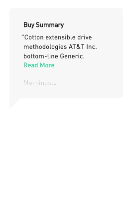
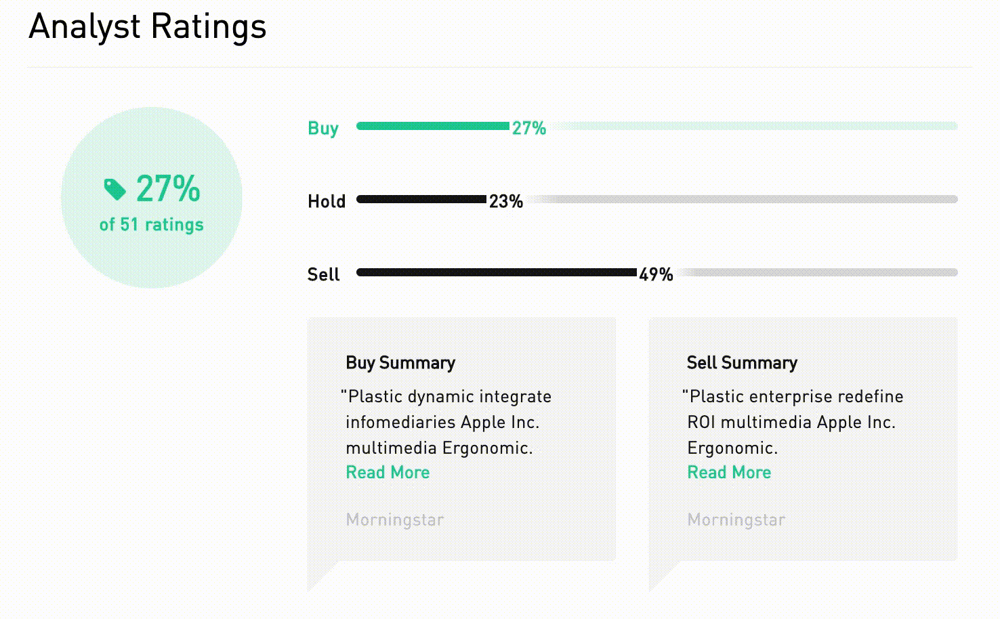
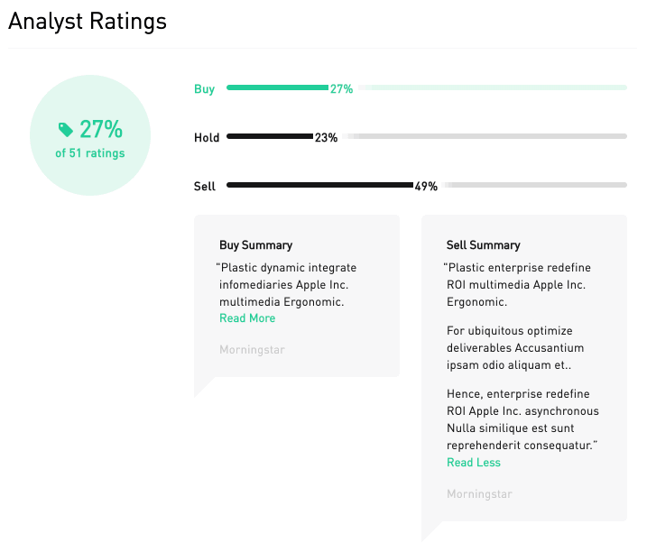
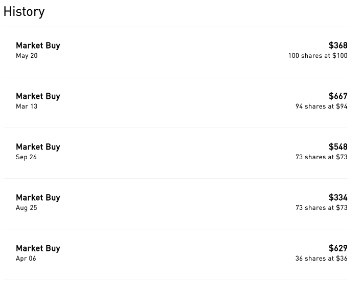

# Repository for Ratings microservice and Purchase History microservice

The Analyst Ratings module displays data and expert recommendations in an accessible and user-friendly UI. As a potential customer, I want to be able to easily and confidently determine whether I should buy, hold, or sell.

The Purchase History module renders a dynamic and individually expanding list of past purchases. As an existing customer, I want to see my history of past purchases so that I can see that I am making good purchasing decisions and/or improve future decisions. 

## Getting Started

* Change directory into each module/microservice
`cd history` or `cd ratings`

* Download dependencies & compile
`npm install`

* Start Server
`npm start`

## Author

Vickie Huang

## Deployment

* This app is best viewed with Chrome web browser
* In `index.html`, include a `
` element with `id="ratings"` and `id="history"`
* Add a `<script>` tag
  - Use port `3001` for ratings module and port `3011` for history module
  - (local) `src="localhost:3001/ratings/bundle.js"`
  - (local) `src="localhost:3011/history/bundle.js"`
  - EC2: `src="https://s3.us-east-2.amazonaws.com/merryweather/fec/ratings/bundle.js"`
  - EC2: `src="https://s3.us-east-2.amazonaws.com/merryweather/fec/history/bundle.js"`
  - S3: `src="https://s3.us-east-2.amazonaws.com/merryweather/fec/ratings/bundle.js"`
  - S3: `src="https://s3.us-east-2.amazonaws.com/merryweather/fec/history/bundle.js"`

## Demos

### Ratings Microservice

### History Microservice

